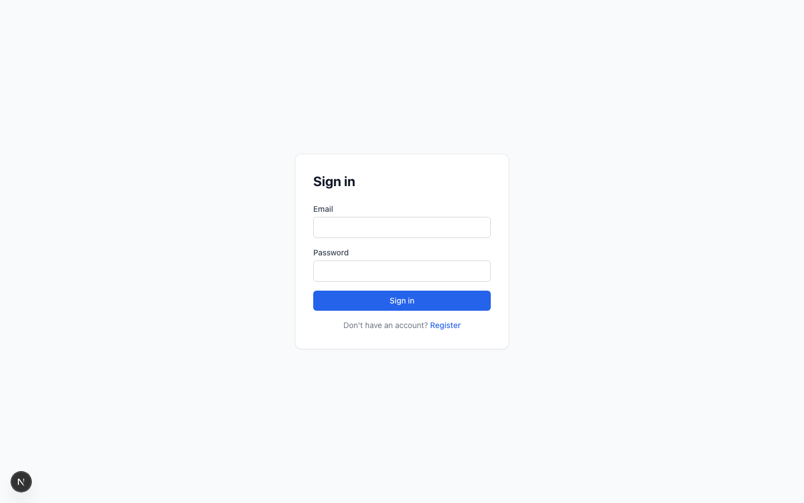
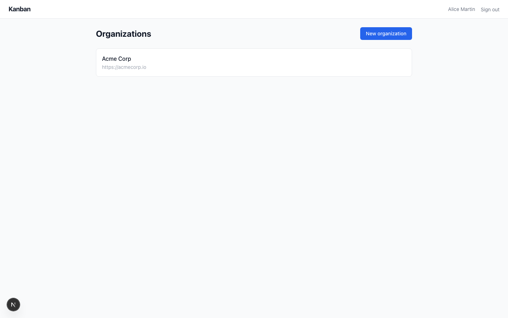
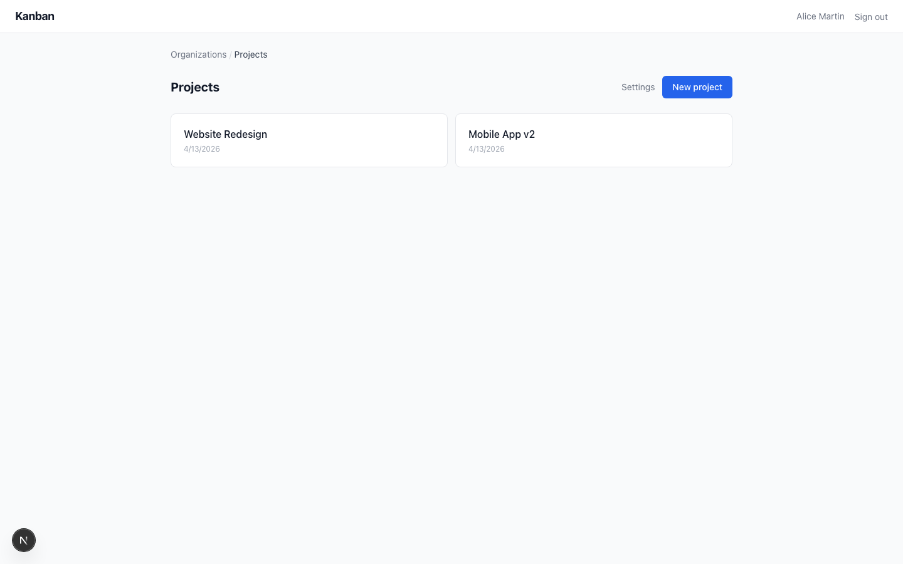
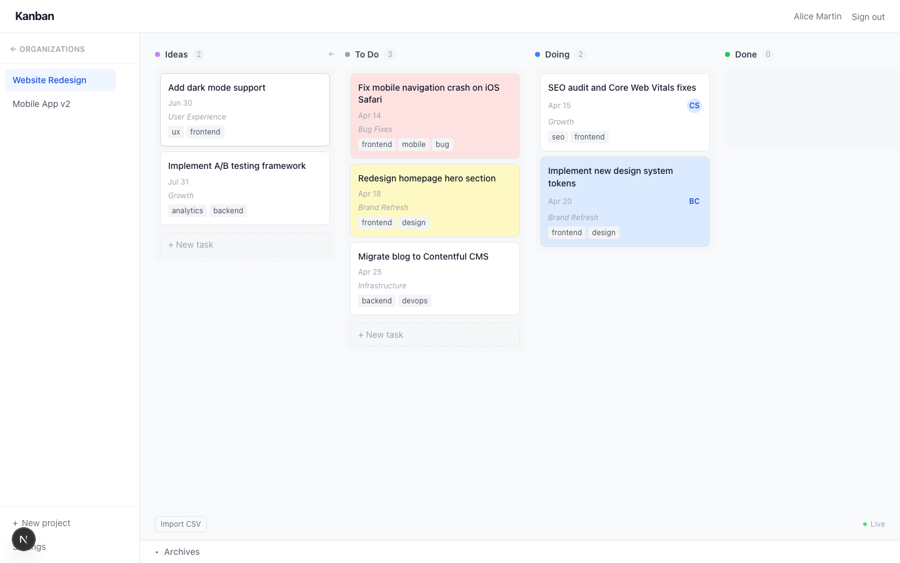
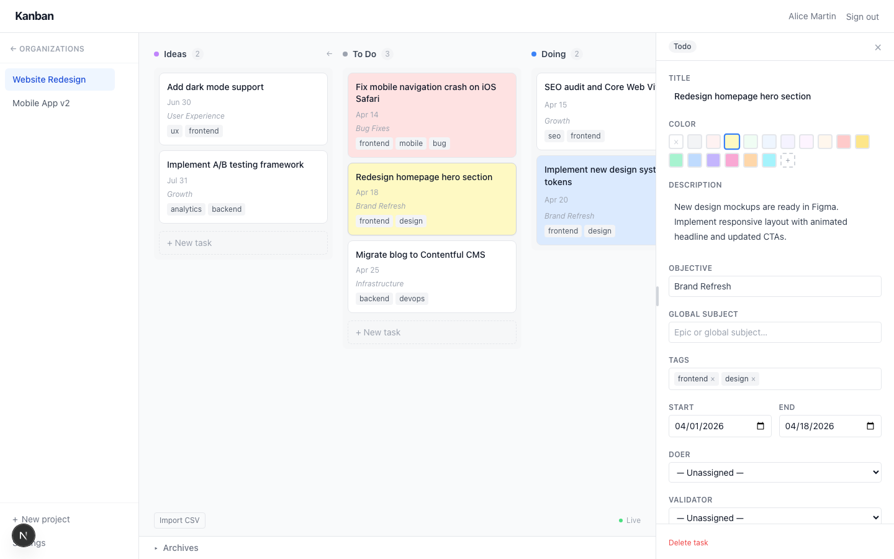
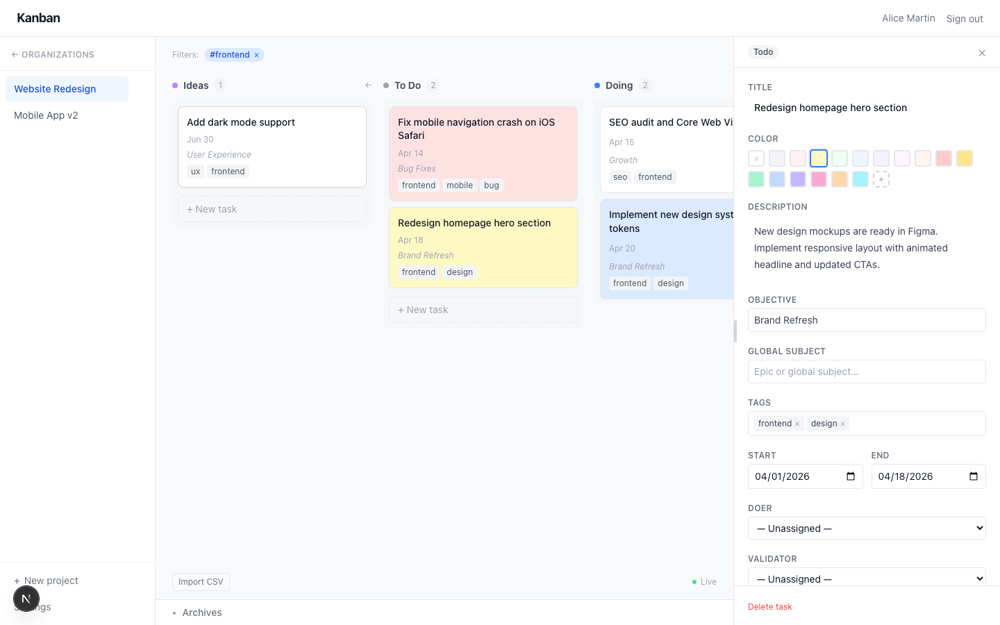
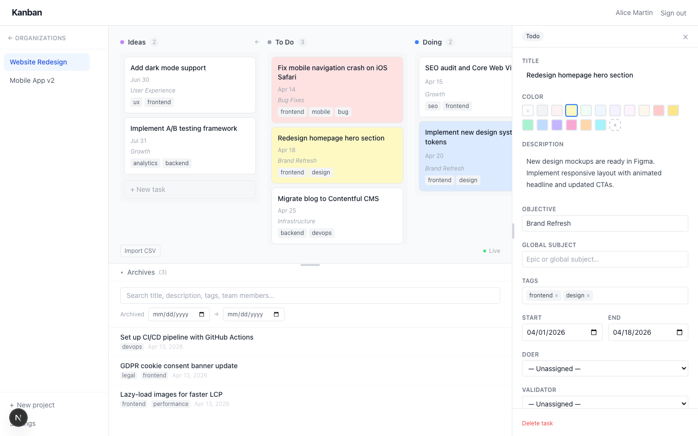
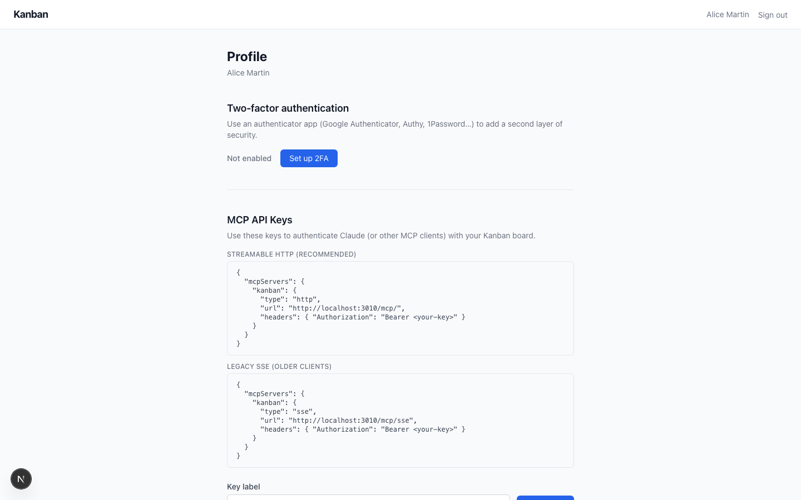
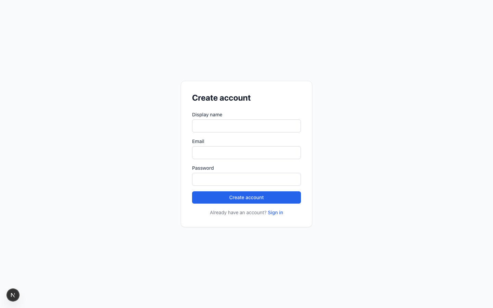

# Kanban

A self-hosted, real-time project management board with built-in MCP server — so AI assistants like Claude can read and write your tasks directly.

> **Built with AI tools:** This project was developed using [Claude Code](https://claude.ai/code), [RTK-AI](https://github.com/rtk-ai/rtk), and [code-review-graph](https://github.com/tirth8205/code-review-graph/).

---

## Table of Contents

- [Features](#features)
- [Screenshots](#screenshots)
- [Tech Stack](#tech-stack)
- [Getting Started](#getting-started)
  - [Environment Configuration](#environment-configuration)
  - [Local Development](#local-development)
  - [Docker](#docker)
- [Demo Data](#demo-data)
- [MCP Integration (Claude / AI)](#mcp-integration-claude--ai)
- [Architecture](#architecture)
- [Environment Variables](#environment-variables)
- [Running Tests](#running-tests)

---

## Features

### Authentication & Security
- **Email + password registration** with email verification (SMTP or console fallback in dev)
- **Two-factor authentication (TOTP)** — Google Authenticator, Authy, 1Password, any TOTP app
- **Two-step login** — email/password then TOTP code when 2FA is enabled
- **JWT access tokens** (short-lived) + **HTTP-only refresh token cookies** (rotated on each use)
- **API keys** — long-lived bearer tokens for MCP / programmatic access

### Organizations & Members
- Create multiple organizations per account
- Invite members via single-use invitation links (shareable URL)
- Role system: **owner** and **member**
- Owner can **transfer ownership** to any member
- Owner can **delete the organization** (requires at least one other org)
- Rename organization and set optional website

### Projects
- Multiple projects per organization
- Create, rename, and delete projects
- All members of the org have access to all projects

### Kanban Board
- Four columns: **Ideas → To Do → Doing → Done**
- Tasks sorted by **due date ascending** (overdue first)
- **Drag-and-drop** tasks between columns
- **Ideas column** collapsible to save horizontal space
- **Color-coded task cards** — set a custom background colour per task
- Auto-assign the moving user as **doer** when dragging a task to Doing (no doer set)
- Auto-clear doer when moving back to Todo

### Task Detail
Each task has a rich detail sidebar with:
- **Title** and **description** (multi-line)
- **Objective** — group tasks under a goal
- **Global subject** — cross-cutting label
- **Start date** and **end date**
- **Reporter**, **Doer**, **Validator** — assignable to any org member
- **Watchers** and **Advisors** — additional stakeholders
- **Tags** — free-form, with autocomplete from existing tags
- **Linked tasks** — bidirectional links between tasks
- **Custom background colour** — colour picker
- **History log** — every field change recorded with who changed it and when
- **Conflict detection** — if two users edit the same field simultaneously, the second user gets a warning with merge options

### Filtering
- Filter by **tag** — click any tag chip on a card
- Filter by **objective**
- Filter by **doer** — click an avatar
- Multiple active filters combine (AND)
- Active filters shown as removable chips with "Clear all"

### Archive
- Multi-select Done tasks with checkboxes
- Archive in bulk with one click
- **Resizable archive panel** at the bottom — drag to resize
- Search archived tasks by title
- Paginated results
- Restore archived tasks back to Todo

### CSV Import
- Upload a `.csv` file to bulk-create tasks
- Columns: `title`, `description`, `startDate`, `endDate`, `column`
- Invalid rows are skipped and reported; valid rows are imported atomically

### Real-Time Collaboration
- **WebSocket** connection per board — live dot indicator (green = connected)
- Task creates, updates, deletes, moves, and reorders pushed to all connected users instantly
- **Conflict-aware editing** — if you are typing in a field and a remote update arrives, the change is held until you blur, then you are shown a diff and asked to choose

### Profile
- View and update display name
- Manage **TOTP 2FA** — enable with QR code scan, disable with code confirmation
- Resend email verification link
- Generate and revoke **MCP API keys** with labels

### MCP Server (Model Context Protocol)
- Exposes your board as an MCP server for AI tools
- **Streamable HTTP** transport (modern, recommended)
- **Legacy SSE** transport (for older MCP clients)
- Authenticated via API key (`Authorization: Bearer <key>`)
- Tools available to AI:
  - `list_organizations`, `create_organization`
  - `list_projects`, `create_project`
  - `list_tasks`, `create_task`, `update_task`, `move_task`, `delete_task`

---

## Screenshots

### Sign in


### Organizations


### Projects


### Kanban Board
Tasks sorted by due date, colour-coded, with tags and assignees visible at a glance. The Ideas column is expanded on the left.



### Task Detail Sidebar
Click any card to open the full detail panel — description, dates, assignees, tags, linked tasks, colour picker, and history.



### Tag Filtering
Click any tag chip to filter the board. Active filters shown as removable chips.



### Archive Panel
Archived tasks are searchable and restorable from the collapsible panel at the bottom.



### Profile & MCP API Keys
Set up 2FA, generate API keys, copy the MCP config snippet for Claude.



### Registration


---

## Tech Stack

| Layer | Technology |
|---|---|
| API | [Hono](https://hono.dev/) on Node.js |
| Database | SQLite via [Drizzle ORM](https://orm.drizzle.team/) + `better-sqlite3` |
| Real-time | WebSockets (`@hono/node-ws`) |
| Web | [Next.js 14](https://nextjs.org/) App Router (Server Components + Server Actions) |
| Auth | JWT access tokens, HTTP-only refresh cookies, Argon2 password hashing |
| 2FA | [otplib](https://github.com/yeojz/otplib) (TOTP) + [qrcode](https://github.com/soldair/node-qrcode) |
| Email | [nodemailer](https://nodemailer.com/) (SMTP) |
| Drag & Drop | [@dnd-kit](https://dndkit.com/) |
| MCP | [@modelcontextprotocol/sdk](https://github.com/modelcontextprotocol/typescript-sdk) |
| Monorepo | pnpm workspaces + Turborepo |
| Tests | Vitest + in-memory SQLite |

---

## Getting Started

### Environment Configuration

The application uses an agnostic approach to configuration. Copy `.env.example` to `.env` and configure your secrets.

The core of the "Plug & Play" setup is the URL configuration:
- `API_URL`: Base URL for the API (server-side).
- `NEXT_PUBLIC_WS_URL`: WebSocket URL for the browser.

#### Zero-Config Switching
The project is designed so you **never** have to change your `.env` when switching between Docker and Local development:
1.  Set your `.env` for **Local Dev** (`localhost`, relative paths).
2.  `docker-compose.yml` automatically **overrides** these values with specific container-internal addresses (`api:3001`, absolute paths) when running in Docker.

### Local Development

**Prerequisites:** Node.js ≥ 20, pnpm ≥ 9

```bash
# Clone and install
git clone https://github.com/sherault/kanban
cd kanban
pnpm install

# Configure environment
cp .env.example .env
# Edit .env — set JWT_SECRET and REFRESH_SECRET (must be ≥ 32 chars)

# Start all apps via Turborepo
pnpm dev
```

Open [http://localhost:3009](http://localhost:3009) in your browser.

### Docker

Running in Docker is the recommended way for production-like environments.

```bash
# Build and start
docker compose up -d --build

# View logs
docker compose logs -f
```

- Web: [http://localhost:3009](http://localhost:3009)
- API: [http://localhost:3010](http://localhost:3010) (exposed for Browser/MCP)

The SQLite database is persisted to `./data/kanban.db` on the host.

---

## Demo Data

A seed script creates three demo users, one organization, two projects, and a realistic set of tasks across all columns.

**Requirements:** both `pnpm dev` servers must be running.

```bash
node scripts/seed.mjs
```

User accounts: `alice@acmecorp.io`, `bob@acmecorp.io`, `carol@acmecorp.io`. Password: `demo1234`.

---

## MCP Integration (Claude / AI)

Connect Claude to your board from the **Profile** page by generating an API key.

**Config Snippet:**
```json
{
  "mcpServers": {
    "kanban": {
      "type": "http",
      "url": "http://localhost:3010/mcp/",
      "headers": { "Authorization": "Bearer <your-key>" }
    }
  }
}
```

---

## Architecture

- **`apps/api`**: Hono API. Stateless domain logic and SQLite.
- **`apps/web`**: Next.js 14. Pure BFF, no direct DB access. Handles SSR and Server Actions.
- **`packages/shared`**: Shared DTO types between front and back.

The web layer is a pure consumer of the API. It uses `API_URL` for internal calls and `NEXT_PUBLIC_API_URL` for client-side hooks.

---

## Environment Variables

| Variable | Required | Description |
|---|---|---|
| `JWT_SECRET` | Yes | Secret for signing access tokens (≥ 32 chars) |
| `REFRESH_SECRET` | Yes | Secret for refresh tokens (≥ 32 chars) |
| `DATABASE_URL` | No | Path to SQLite file (default: `./data/kanban.db`) |
| `PORT` | No | Internal API port (default: `3001`) |
| `APP_URL` | No | Public URL of the frontend (for email links) |
| `API_URL` | No | API URL for server-to-server calls (Internal Docker: `http://api:3001`) |
| `NEXT_PUBLIC_WS_URL` | Yes | WebSocket URL for the browser (`ws://localhost:3010`) |

---

## Running Tests

Tests in `apps/api` use an in-memory database.

```bash
pnpm test
```
